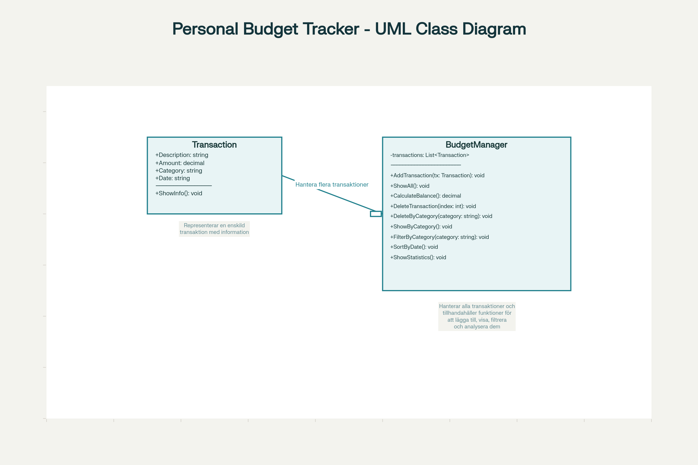
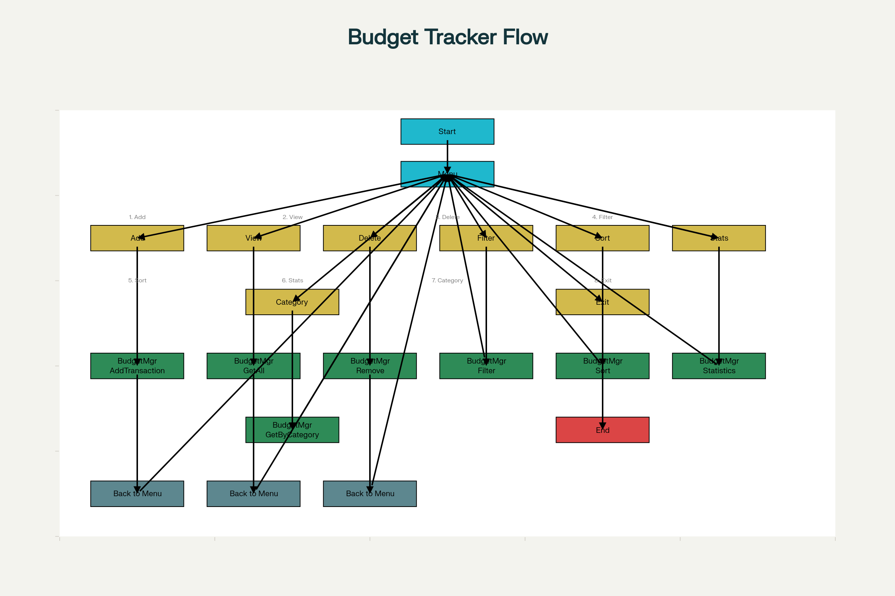

# Personal Budget Tracker

En komplett C#-konsolapplikation för att hantera din privatekonomi. Programmet har ett fokus på tydlig struktur, pedagogik och god kodpraxis.

---

## Projektinformation

- **Lägg till transaktioner** (inkomst eller utgift): Ange beskrivning, belopp, kategori, datum. Inkomster är alltid gröna, utgifter visas med röd färg i terminalen.
- **Visa alla transaktioner** med full info och färgkodning.
- **Visa total balans** (inkomster minus utgifter).
- **Ta bort enskild transaktion** eller **alla i vald kategori**.
- **Filtrera och sortera** poster på kategori eller datum.
- **Visa statistik:** antal transaktioner, summa inkomster, summa utgifter.
- **Pedagogiskt menysystem**.
- **All data hanteras i minnet via C#-Listor.**

---

## Klassdiagram (UML)

Diagrammet visar de två huvudklasserna i programmet:

- **Transaction**  
  Representerar en enskild inkomst eller utgift.  
  Egenskaper:  
  - Description (string)
  - Amount (decimal)
  - Category (string)
  - Date (string)  
  Metod:  
  - ShowInfo(): Skriver ut rad med färg.

- **BudgetManager**  
  Ansvarar för all logik som rör hantering av transaktioner:
  - List<Transaction>: lagrar alla poster.
  - Metoder: AddTransaction, ShowAll, CalculateBalance, DeleteTransaction, DeleteByCategory, ShowByCategory, FilterByCategory, SortByDate, ShowStatistics  
  BudgetManager har en **aggregation** till Transaction (dvs. hanterar många Transaction-objekt).

**Diagrammet visualiserar egenskaper och metodsignaturer tydligt, samt relationen och rollbeskrivning för varje klass.**

---

## Flödesschema (Flowchart)

Flödesschemat visar programmets logik och användarflöde:

- Startpunkt
- Användaren väljer menyval:  
  - Lägg till transaktion
  - Visa alla transaktioner
  - Radera transaktion(er)
  - Filtrera, sortera
  - Visa statistik
  - Visa per kategori
  - Avsluta
- Varje val anropar rätt metod i BudgetManager.
- Efter åtgärd återgår programmet till huvudmenyn tills avslut väljs.

**Flowcharten visualiserar hur användaren interagerar med applikationen samt hur logiken är uppdelad och återkopplad till kodens metoder.**

---

## Installation

1. Klona repository från GitHub:
2. Öppna projektet i Visual Studio (eller annan C#-IDE).
3. Bygg och kör programmet.

---

## Användning

- Kör programmet och välj funktion via meny.
- Få direkt feedback och färgkodning.
- All hantering sker i minnet.

--- 

## Reflektion

- Hur hjälpte klasser och metoder dig att organisera programmet?

 Att använda klasser och metoder gjorde det mycket enklare att organisera mitt projekt. Genom att dela upp koden i Transaction och BudgetManager blev allt både tydligare och lättare att ändra eller bygga vidare på. 
 Med metoder kunde jag återanvända kod och snabbt lägga till nya funktioner utan att skapa onödig röra.
 
- Vilken del av projektet var mest utmanande?
 
Det knepigaste var helt klart att hålla ordning på all information – jag tappade nästan greppet ibland! Mycket blev lättare med hjälp av flowchart och UML-diagram, då kunde jag se hur allt hänger ihop. 
Färgkodningen var också en utmaning; att få inkomster till grönt och utgifter till rött tog lite testande innan det blev rätt. Men när allt väl satt funkade menysystemet och färgerna precis som jag ville.

--- 

## Made By:
- BenjiW
- Developer Student at NBI
- 2025/19/10
